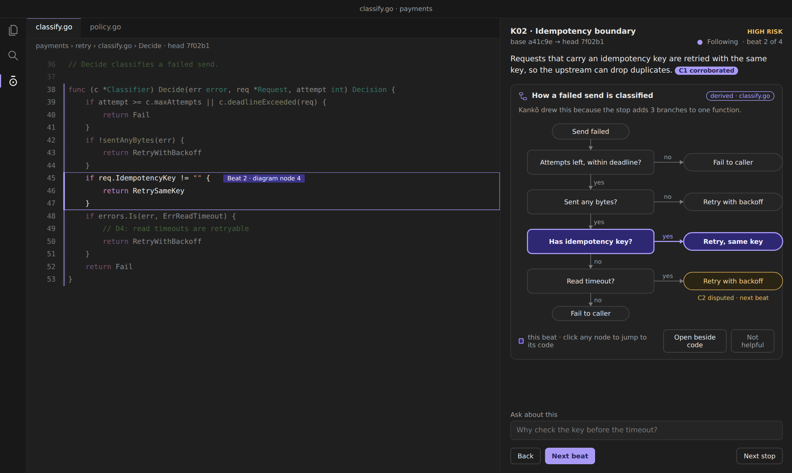
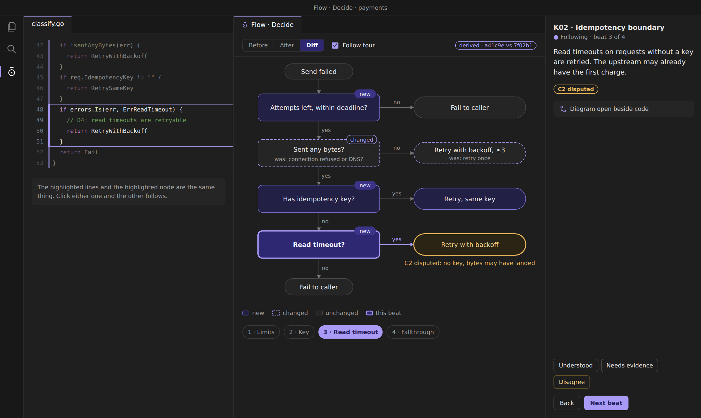
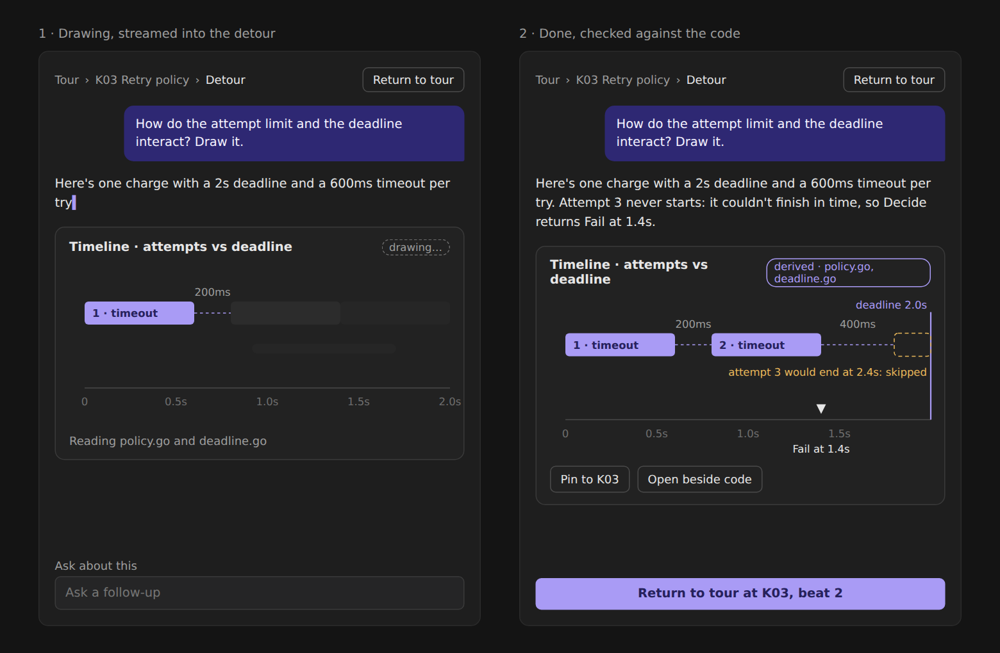
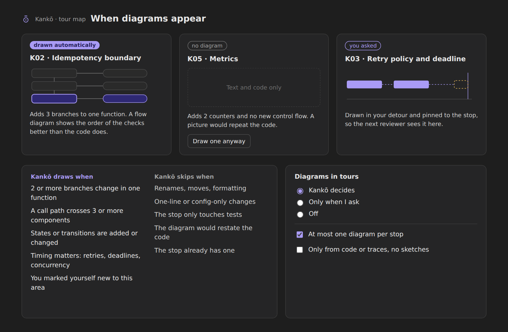
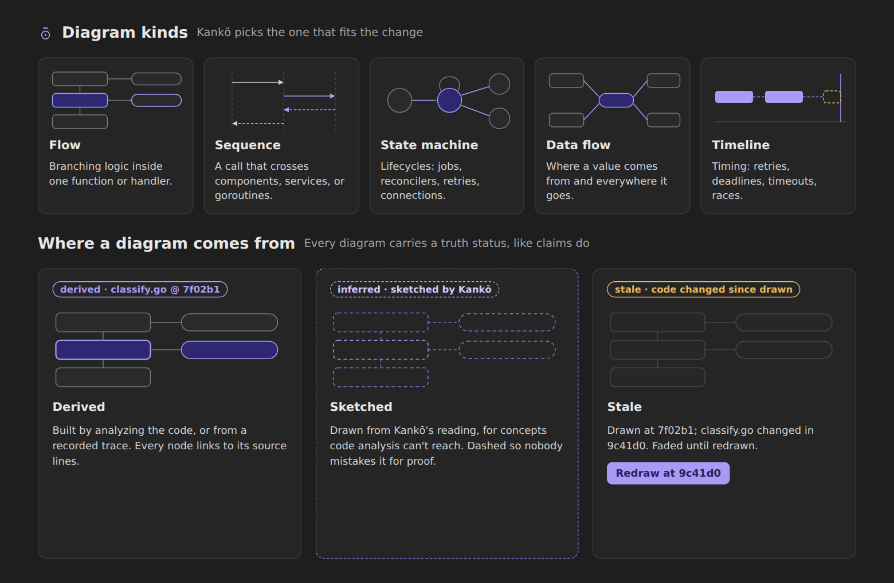

# Kankō: agent-drawn diagrams

Status: ready for implementation
Date: 2026-10-05
Owner: Eric
Builds on: *Narration side panel spec* (implemented) and *Tour presentation in diff views* (implemented). Earlier docs use the old name Relay; all identifiers here use `kanko`.

## Summary

Kankō agents can attach a diagram to a tour stop or beat when a picture explains the change better than prose and code alone. The agent decides when a diagram fits unless the reviewer asks for one or has turned the feature off. Diagrams live in the narration panel, can open beside the code, follow the tour beat by beat, compare before and after, and carry a truth status like every other claim in Kankō.

The running example throughout is the payments retry change (base `a41c9e`, head `7f02b1`), stop K02 "Idempotency boundary", file `payments/retry/classify.go`.

## Goals

- Give reviewers a second way to understand a change: structure and flow, not only narration.
- Keep diagrams honest. Every diagram states where it came from, and a sketch never passes as proof.
- Keep the diagram and the code in lockstep. Selecting a node moves the presenter pointer, and the current beat highlights its node.
- Let the agent judge when a diagram helps, with clear, inspectable reasons, and stay out of the way when it doesn't.

## Non-goals (v1)

- Free-form whiteboarding or reviewer-edited diagrams.
- Architecture diagrams of the whole codebase. Diagrams are scoped to one stop or one detour question.
- Exporting diagrams to external tools.
- Animated playback of diagrams.

## Mockups

### 1. Diagram inside a beat



- The diagram is a card inside the narration panel, under the beat narration.
- Card header: kind icon, title, provenance chip (`derived · classify.go`).
- One line under the header states why Kankō drew it. This is the agent's `reason` and is required.
- The node(s) for the current beat are highlighted (night fill, violet 2px stroke). The editor's focus box marks the same lines, and its beat label names the node.
- Nodes tied to disputed claims use the amber treatment and show the claim id.
- Footer: legend, **Open beside code**, **Not helpful** (sends feedback, collapses the card for this stop).
- Clicking a node moves the presenter pointer to that node's anchor (local navigation, no agent round trip).

### 2. Beside the code, following the tour



- **Open beside code** opens a webview editor tab (`Flow · Decide`) in the group next to the code.
- Toolbar: segmented **Before / After / Diff** (default Diff when a before graph exists), **Follow tour** checkbox (default on), provenance chip with both revisions.
- Diff mode tags nodes and edges `new`, `changed` (with a `was: …` sublabel), or `removed` (dashed gray, struck label). Unchanged items are neutral.
- With Follow tour on, beat changes re-highlight the matching node(s) and scroll them into view. Clicking a node while following moves the presenter pointer; the panel stays in sync.
- Beat strip below the diagram: one chip per beat that maps to nodes. Clicking a chip activates that beat.
- If the reviewer pans or clicks around the diagram, treat it like editor exploring: stop auto-scrolling the diagram until **Return to tour**.

### 3. Reviewer asks for a diagram



- Any question can ask for a drawing ("draw it", "show me a diagram"). The agent answers in a detour as usual.
- The diagram streams: axes and early elements appear first, unresolved parts render as neutral placeholders, and the chip reads `drawing…` with a status line ("Reading policy.go and deadline.go").
- When done, the chip switches to its final provenance, and actions appear: **Pin to K03** (saves it to the stop for future reviewers), **Open beside code**, **Return to tour**.
- Requested diagrams count as `origin: "requested"` and are exempt from the auto budget.

### 4. When diagrams appear



- The tour map shows per-stop diagram state: drawn automatically, skipped (with the reason), or requested.
- Skipped stops show the reason and **Draw one anyway**, which turns into a request.
- Settings live in the panel's settings and in VS Code settings (see Settings).

### 5. Diagram kinds and provenance



## Diagram kinds

| Kind | Use when | Typical source |
| --- | --- | --- |
| `flow` | Branching logic inside one function or handler changes | AST of the function at each revision |
| `sequence` | A call crosses components, services, or goroutines | Recorded trace, else call graph |
| `state` | Lifecycle states or transitions are added or changed | Enum/state constants plus transition sites |
| `dataflow` | The question is where a value comes from or goes | Static data-flow analysis |
| `timeline` | Timing matters: retries, deadlines, timeouts, races | Policy constants plus trace timestamps |

The agent picks one kind per diagram. If two kinds both fit, prefer the one whose source can be derived rather than sketched.

## When the agent draws

### Modes

| Setting `kanko.diagrams.mode` | Behavior |
| --- | --- |
| `auto` (default) | The agent decides per stop during tour preparation and may add one in a detour when it helps the answer. |
| `onRequest` | No automatic diagrams. Requests and **Draw one anyway** still work. |
| `off` | No diagrams at all. Requests get a text answer plus a one-line note that diagrams are off. |

An explicit request always wins over the agent's judgment, except in `off` mode.

### Signals

The extension computes these deterministically during tour preparation and hands them to the agent with each stop. The agent makes the final call and must write a `reason` either way.

Draw when one or more of these hold:

- 2 or more branches added or changed in one function (`flow`).
- A changed call path crosses 3 or more components (`sequence`).
- States or transitions added, removed, or changed (`state`).
- A changed value flows through 3 or more functions (`dataflow`).
- Retry, backoff, timeout, deadline, or concurrency primitives changed (`timeline`).
- The reviewer marked themselves new to this area (lowers the bar; still needs one structural signal).

Skip when any of these hold:

- The stop is renames, moves, or formatting only.
- One-line or config-only change.
- The stop only touches tests.
- The diagram would have fewer than 4 nodes or would restate the code line by line.
- The stop already has a diagram and the budget is 1.

### Budget

- `kanko.diagrams.maxPerStop` default 1. Requested diagrams do not count.
- Skipped decisions are recorded with their reason so the tour map can show them.

## Data model

Diagrams are stored in the change dossier alongside stops and beats.

```ts
type DiagramKind = "flow" | "sequence" | "state" | "dataflow" | "timeline";
type DiagramProvenance = "derived" | "inferred";

interface Diagram {
  id: string;
  kind: DiagramKind;
  title: string;                       // "How a failed send is classified"
  stopId: string;
  origin: "auto" | "requested";
  reason: string;                      // shown under the card header; required
  provenance: {
    status: DiagramProvenance;         // "inferred" = sketched by the agent
    method: "static-analysis" | "trace" | "agent-sketch";
    sources: SourceRef[];              // files, symbols, trace ids used
    revs: { before?: string; after: string };
  };
  before?: Graph;                      // present when a meaningful before exists
  after: Graph;
  pinned: boolean;                     // true for pinned detour diagrams
  sourceHash: string;                  // hash of all anchored ranges, for staleness
  createdAt: string;
}

interface Graph {
  nodes: DiagramNode[];
  edges: DiagramEdge[];
  lanes?: Lane[];                      // sequence participants, timeline lanes
  axis?: { unit: "ms" | "s"; min: number; max: number; marks?: AxisMark[] }; // timeline only
}

interface DiagramNode {
  id: string;                          // stable across before/after, see Diff
  label: string;
  sublabel?: string;
  shape: "start" | "decision" | "action" | "terminal" | "state" | "participant" | "span";
  anchor?: Anchor;                     // required when provenance is "derived"
  beatIds?: string[];                  // beats that highlight this node
  claimIds?: string[];                 // claims shown on the node (e.g. disputed)
  span?: { lane: string; start: number; end: number; style?: "solid" | "ghost" }; // timeline
}

interface DiagramEdge {
  id: string;
  from: string;
  to: string;
  label?: string;                      // "yes", "no", "Send, attempt 2"
  kind?: "flow" | "call" | "return" | "transition" | "data" | "wait";
  order?: number;                      // sequence ordering
  beatIds?: string[];
}
```

`Anchor` is the existing type from the presentation spec (path, side, rev, context, focus, symbol, contentHash).

### Stable ids and diff

- Node ids derive from the anchored construct, not from position: `flow` uses `symbol + condition fingerprint`, `state` uses the state constant, `sequence` uses `participant + call symbol`.
- Diff compares `before` and `after` by id: present only in after → `new`; in both with different label, edges, or anchor content → `changed` (keep the old label as `was:`); only in before → `removed`.
- If ids can't be matched reliably (heavy refactor), show After only and hide the Diff toggle. Don't show a misleading diff.

## Provenance and truth status

| State | When | Visual |
| --- | --- | --- |
| `derived` | Built from static analysis or a recorded trace at the stated revisions | Solid strokes, chip `derived · <source>`, every node links to code |
| `inferred` | Sketched by the agent for concepts analysis can't reach | Dashed strokes and dashed card border, chip `inferred · sketched by Kankō`, nodes without anchors aren't clickable |
| `stale` | `sourceHash` no longer matches the current head | 40% opacity, chip `stale · code changed since drawn`, **Redraw at <sha>** button |

Rules:

- A `derived` diagram must anchor every node. Validation rejects it otherwise.
- `kanko.diagrams.derivedOnly: true` blocks `inferred` diagrams entirely.
- Stale detection runs on beat activation and on revision change (the existing drift check). Stale diagrams are never silently redrawn; the reviewer chooses.
- A diagram can't upgrade a claim's truth status. It can cite a claim (`claimIds`) and must render that claim's current status.

## Rendering

- Diagrams render as SVG in a webview: inside the narration panel webview for the card, and in a dedicated `WebviewPanel` for the expanded view.
- Layout: use ELK (`elkjs`, layered algorithm) for `flow`, `state`, and `dataflow`. Write small custom layouts for `sequence` (fixed lanes, ordered rows) and `timeline` (time axis). Keep layout deterministic so before and after line up.
- Size limits: card ≤ 12 nodes, expanded ≤ 40 nodes. Over the card limit, the card shows a summary thumbnail and opens the expanded view.
- Colors come from the existing `kanko.*` theme colors plus one new token: `kanko.attention` (amber) for disputed and stale. Diff colors stay out of diagrams; diagram diff uses tags and stroke style.
- Mermaid was considered and rejected for v1: node-to-code linking, stable diff styling, and deterministic layout across revisions are all harder to control.

## Interaction

| Action | Result |
| --- | --- |
| Beat activated | Highlight nodes and edges whose `beatIds` include the beat; scroll them into view if following |
| Click node (anchored) | Move presenter pointer to the node's anchor; activate its first beat if it has one |
| Click node (unanchored sketch) | Show its label and a note that it has no code location |
| Hover node | Tooltip with label, anchor path:line, claim chips |
| **Open beside code** | Open or focus the diagram's `WebviewPanel` beside the code group |
| Before / After / Diff | Switch graph view; selection and beat highlight persist by node id |
| **Not helpful** | Send `diagram_feedback`; collapse the card for this stop |
| **Draw one anyway** | Send a `diagram_request` for the stop |
| **Pin to Kxx** | Persist the detour diagram on the stop (`pinned: true`) |
| **Redraw at <sha>** | Send a `diagram_request` with `replaces: <diagramId>` |

Keyboard: Tab moves through nodes in reading order, Enter jumps to code, arrow keys follow edges.

## Agent protocol additions

New MCP tools on the existing Kankō server:

| Tool | Args | Returns | Notes |
| --- | --- | --- | --- |
| `kanko_diagram_put` | `diagram` (without `id`) | `diagramId`, validation errors | Attaches to `stopId`. Rejected if the budget is exceeded for `auto`, a derived node lacks an anchor, anchors don't resolve, or size limits are exceeded |
| `kanko_diagram_skip` | `stopId`, `reason` | ack | Records a skip so the tour map can show it |
| `kanko_diagram_stream` | `detourId`, `diagramId`, `patch`, `final` | ack | Incremental node and edge additions for detour answers |
| `kanko_diagram_pin` | `diagramId`, `stopId` | ack | Usually triggered by the reviewer; available to the agent when the reviewer asks |

New reviewer events delivered by `kanko_await_reviewer`:

```ts
| { kind: "diagram_request"; id: string; stopId: string; text?: string; replaces?: string; context: ReviewerContext }
| { kind: "diagram_feedback"; id: string; diagramId: string; value: "not_helpful" }
```

Node clicks, view toggles, and beat sync stay local to the extension and never reach the agent.

### Skill guidance (for the agent)

- Decide per stop during tour preparation, using the signals. Call `kanko_diagram_put` or `kanko_diagram_skip` for every stop in `auto` mode.
- Write `reason` as one plain sentence about the change, not about diagrams in general ("adds 3 branches to one function").
- Prefer derived over sketched. Sketch only for concepts code analysis can't reach, and say so in `reason`.
- Map each beat to at most 3 nodes. A diagram whose nodes don't line up with beats probably belongs to a different stop.
- Never draw to decorate. If the diagram would have fewer than 4 nodes or mirror the code line by line, skip it.

## Settings

| Setting | Type | Default |
| --- | --- | --- |
| `kanko.diagrams.mode` | `"auto"` \| `"onRequest"` \| `"off"` | `"auto"` |
| `kanko.diagrams.maxPerStop` | integer 0–3 | `1` |
| `kanko.diagrams.derivedOnly` | boolean | `false` |
| `kanko.diagrams.openBeside` | `"ask"` \| `"always"` \| `"never"` | `"ask"` |

## Accessibility

- Every diagram SVG has `role="img"` and an `aria-label` summary generated from the graph.
- **Describe as text** in the card menu renders the graph as an ordered list (nodes, branches, outcomes), which screen readers and copy-paste can use.
- Status is never color-only: `new`, `changed`, `disputed`, and `stale` always appear as text tags.
- Nodes are focusable, with visible focus rings using `kanko.presenterFocus`.

## Acceptance criteria

- [ ] In `auto` mode, the K02 example tour produces a `flow` diagram for K02 and a recorded skip for K05, each with a reason.
- [ ] Activating beat 2 of K02 highlights the "Has idempotency key?" node and its yes edge, and the editor focus box covers the same lines.
- [ ] Clicking any node in a derived diagram moves the presenter pointer to its anchor without contacting the agent.
- [ ] Diff mode shows `new` on the three added decisions and `changed` with `was:` text on the modified decision and outcome.
- [ ] Turning off Follow tour, then changing beats, does not move the diagram.
- [ ] A detour request streams a diagram, ends with `derived` provenance, and **Pin to K03** persists it on the stop across reloads.
- [ ] A derived diagram with an unanchored node is rejected by `kanko_diagram_put`.
- [ ] After a new commit changes `classify.go`, the K02 diagram renders stale and offers **Redraw at <sha>**.
- [ ] `onRequest` mode produces no automatic diagrams; `off` mode hides all diagram UI and answers requests with text.
- [ ] Every diagram has an accessible label and a text description.

## Open questions

- Should requested diagrams in `auto` mode ever count against the per-stop budget when pinned?
- Should "Not helpful" feedback lower the agent's drawing rate for the rest of the tour, or only for that stop?
- Should timeline diagrams take concrete numbers from config (as in the mockup) or from recorded traces when both exist and disagree?
- Is ELK's bundle size acceptable inside the panel webview, or should the card use a lighter custom layered layout and reserve ELK for the expanded view?

## Source mockups

The editable mockups are on the "Kankō handoff visualizations" design canvas, section "Agent-drawn diagrams" (boards 1 to 5). The images in `images/` are renders of those boards.
